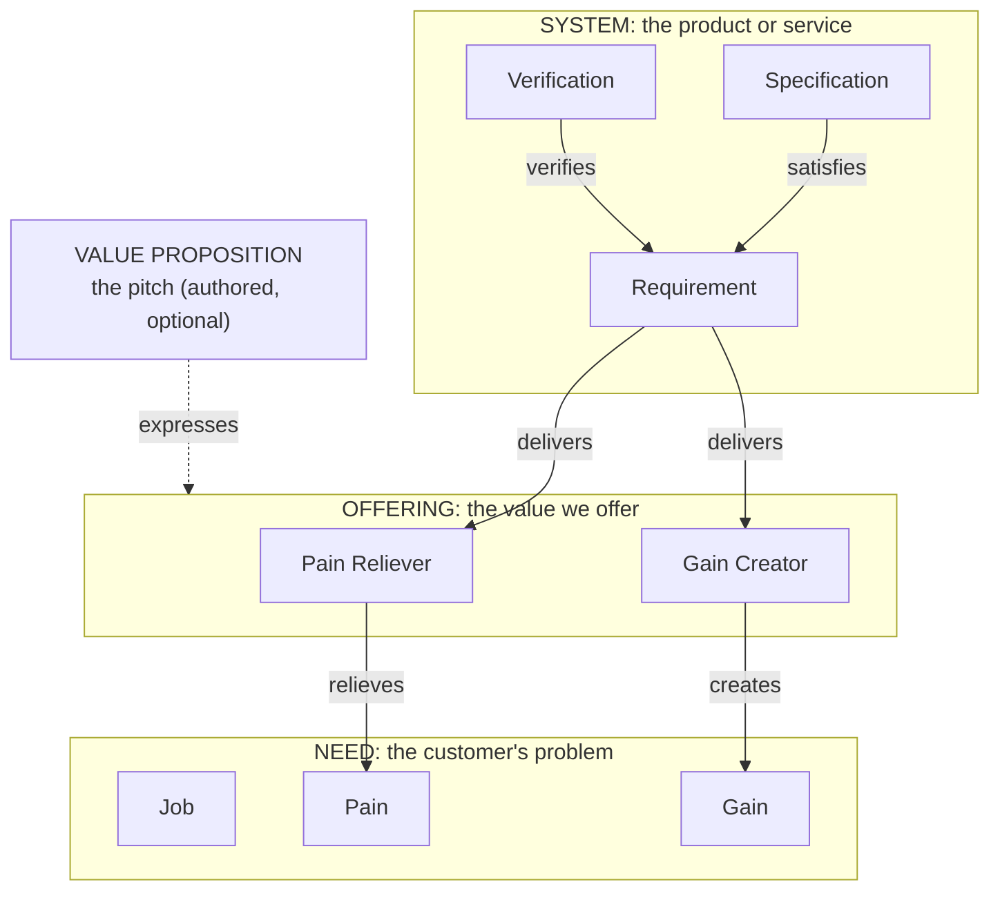

# From customer need to specification

How Note connects a customer's need to what gets built, the names it uses for each part, and the methodologies that shaped them.
This is background and orientation, not normative text; the binding definitions live in `loom/note/`.

## Overview

The default path through Note is the spine: Need, Requirement, Specification, Verification.
That chain is always available with no configuration beyond enabling the spine pack (which is the default).

When a team also wants to work with customer-discovery vocabulary, jobs, pains, gains, offerings, pain-relievers, gain-creators, and value-propositions, they enable the discovery pack.
The discovery pack is opt-in: a corpus that enables it gains the full Value Proposition Canvas vocabulary; one that does not pays nothing for it.

With the discovery pack enabled, every product sits between two worlds: the **customer's problem** and **our answer to it**.
Note keeps those two worlds as separate descriptions and treats the relationship between them as a thing in its own right.
Stated as a single line:

> **Need** (the problem) -- **Fit** -- **Offering** (the value) -- delivered by -- **System** (the product or service), with an optional **Value Proposition** that states the pitch.

Need and Offering are independent descriptions; the **Fit** is the computed correspondence between them; the **Value Proposition** is the optional authored pitch; the System enacts the Offering through its Requirements and Specifications.

## The spine: the always-on default

The spine pack is the default.
A corpus that names no pack has the spine.

The spine trace runs:

```
Need -> Requirement -> Specification -> Verification
```

A **Need** records what a persona wants, in their own terms.
A **Requirement** is the solution-free obligation that addresses the need.
A **Specification** designs the requirement.
A **Verification** confirms the specification or requirement holds.

At the spine level, a Need is a single file: its lead states the want and why it matters, its `persona` frontmatter names the persona, and its body may carry `## Source` and `## Illustrative situations` sections.
A Requirement `addresses` the Need.

This is enough for the vast majority of bodies of work.
The discovery pack is added only when the Value Proposition Canvas vocabulary earns its place.

## The discovery pack: opt-in enrichment

Enabling the discovery pack (by listing `discovery` in the manifest's `packs`) adds eight kinds: Job, Pain, Gain, Offering, Pain Reliever, Gain Creator, Value Proposition, and System.
It also adds the facet reading of a Need and the Offering value-map model.

### The need as a profile

When the discovery pack is enabled, a Need becomes a *profile* over its Job, Pain, and Gain facets.
The need file itself (with its `persona` and job-story lead) sits beside a facet folder that holds the individual facet artifacts, one per file.
The facets are:

- a **Job**, a task the persona is getting done (functional, social, or emotional);
- a **Pain**, a negative the persona suffers or fears (a problem, an obstacle, or a risk);
- a **Gain**, a positive the persona wants (a required, expected, desired, or unexpected outcome).

A need that has not been given the facet treatment is *raw*: it exists as a single file and its Requirements address it directly.
A need that has been given facets is *propositioned* when an Offering `addresses` it.

### The offering as a value map

An **Offering** is the answer to a need, described in the persona's terms.
It is a *value map* over its Pain Reliever and Gain Creator facets:

- a **Pain Reliever** eliminates, reduces, or minimizes a Pain;
- a **Gain Creator** produces, increases, or maximizes a Gain.

An Offering's profile file sits beside its facet folder, just as a Need's does.

### The fit is derived

The **Fit** is the computed correspondence between the two axes: the set of `relieves` (Pain Reliever to Pain) and `creates` (Gain Creator to Gain) edges.
The Fit is never authored as a separate artifact; it is read off the edges.
A Pain with no inbound `relieves` is an uncovered pain; a Pain Reliever with no target is a solution looking for a problem; a Pain Reliever or Gain Creator that no Requirement `delivers` is value offered that no obligation yet realizes.
All are computable gaps, not ill-formed artifacts.

### Raw and propositioned needs

A *raw* need is addressed directly: its Requirements may `relieves` its Pains, `creates` its Gains, and `addresses` its Jobs at facet granularity, with no Offering between the need and the obligations.

A *propositioned* need has an Offering that `addresses` it: the Offering's relievers and creators carry the fit for the facets they cover, and the Requirements `delivers` those relievers and creators.

The spine is untouched either way: a Requirement `addresses` the Need it serves in both states, because the core corpus stays valid whatever packs are enabled.
Coverage of a propositioned need then reads as a labeled union of both channels, obligations addressing the need directly and obligations delivering its Offering's facets; an obligation outside the pitched value (a regulatory constraint, a non-functional floor) keeps the direct edge as its honest home, and a direct edge beside a complete delivers chain is reported as redundant, information for the owner, never an error.
What the Offering changes is the fit path, per facet: a covered Pain or Gain takes its fit edge from the Offering, retiring any direct Requirement shortcut on that facet.
What the `delivers` chain adds is the realization trace, so a pitched Value Proposition is substantiated all the way down: it `expresses` the Offering, the Offering's facets relieve and create the Need's facets, Requirements deliver those facets, Specifications satisfy the Requirements, and Verifications confirm them.
The claim on a landing page is then a true statement by inspection: the product does that, and the trace shows it.

The value layer is adopted one need at a time: a corpus may leave most needs raw and propose value only where the pitch and the fit are worth the machinery.

### The value proposition

The **Value Proposition** is the authored claim: the customer-facing pitch a team puts on a landing page or in a sales deck.
It is optional even when the discovery pack is enabled.
It `expresses` an Offering, and the Fit substantiates it: Note can flag a Value Proposition whose promised benefit is not actually backed by the Offering's relievers and creators, and, through the `delivers` chain, one whose offered value no Requirement yet realizes.

## The shape with discovery enabled



The `relieves` and `creates` edges, taken together, are the **Fit**: the computed evidence of which pains and gains are actually covered.
The **Value Proposition** is the *authored* pitch, the claim that the Fit substantiates.

## The System: where "Products and Services" lives

The Value Proposition Canvas puts a third element on the offering side, alongside pain relievers and gain creators: **Products and Services**.
In Note that thing is the **System**: the system-of-interest under design, an arrangement of parts achieving a coherent purpose, which can be a product, a service, or anything else.
The System is defined by its Requirements, designed by its Specifications, checked by its Verifications, and bounded by its Context.
It is what *provides* the Pain Relievers and Gain Creators, and that value fits the Need.

- a **Requirement** `delivers` a Pain Reliever or Gain Creator (the System provides the value);
- a **Specification** `satisfies` a Requirement (it designs it);
- a **Verification** `verifies` a Requirement or Specification (it checks it).

### The `system` kind and the `provides` verb

When a corpus has more than one system-of-interest that must be told apart, the discovery pack offers a first-class **`system`** kind: one artifact per system, each naming what it delivers.
For the common single-system corpus, the system is implicit in its one Context and no `system` artifact is needed; the kind earns its place only when more than one system must be attributed value separately.
The decision is [The system-of-interest provides the value](../loom/note/decisions/system-of-interest-provides-value.md){id=note:dec:swar6np}.

A system `provides` the Offerings, Value Propositions, Pain Relievers, or Gain Creators it delivers.
The `provides` verb is authored on the system (the provider) and points to the value; its inverse `providedBy` is a derived view and is never authored.
It is optional and repeatable: a coarse claim names a whole Offering or Value Proposition, a finer one names the specific Pain Relievers or Gain Creators a system delivers, letting a multi-system corpus record which system provides which facet of value.
`provides` is the offering-side counterpart of `framedBy`: just as a Pain or Gain names the Job it is felt against, a reliever or creator can name the system that provides it.

A one-line example: `gateway.md` (a system) carries `- provides: [Short links](../offerings/short-links.md){id=note:offering:…}`.

In the diagram above, a `system` node would sit beside the SYSTEM subgraph, with a `provides` arrow pointing to the Offering (or directly to a Pain Reliever or Gain Creator); the Requirements, Specifications, and Verifications inside the subgraph remain unchanged.
`provides` is the authored claim; the computed evidence that substantiates it is the fit derived from `@intent` citations in code and commits, resolved against the deployed version.

A Verification targets whatever the check directly establishes.
A check that confirms the System conforms to a design or contract verifies the **Specification**: an OpenAPI contract test, for instance, asserts the status codes and schemas the spec fixes, so it verifies the spec, not the requirement behind it.
The OpenAPI document the test runs against is the Specification's declared authority, named in its `authority` frontmatter field: the Specification answers to that document, and the Verification uses it as the oracle it checks the implementation against.
A check that confirms an obligation directly, with no design in between, such as a load test for "p95 latency under 200 ms", verifies the **Requirement**.
Either way the requirement is met transitively: the Specification `satisfies` the Requirement, and the Verification confirms the System honors the Specification.
Confirming that the spec is the *right* contract for the requirement is a separate judgment on the `satisfies` link, closer to validation, and usually made by review rather than by the test.

## Levels of adoption

How much of this to capture is the adopter's choice.
The methodology is built to be taken on in layers rather than all at once.

At the narrowest level, a corpus captures only the spine: Needs, Requirements, Specifications, Verifications.
This is the default and requires no manifest configuration beyond the spine pack.
A brownfield system often starts here, because the requirements and specifications already carry value on their own.

At the next level, a corpus enables the discovery pack and adds facets to its needs, authoring Jobs, Pains, and Gains per need.
Requirements may carry direct `relieves` and `creates` links to the facets (raw needs), collapsing fit and delivery into one link, and the corpus gets traceability from an obligation to the problem it answers.

At a fuller level, a corpus also authors Offerings, routes its Requirements through Pain Relievers and Gain Creators, and authors Value Propositions where the pitch earns its place.
Every facet is individually addressable, the value is framed in the customer's terms, the marketing claim has a single source, and the fit is auditable.

Moving up a level is a deliberate step taken when it earns its place, and it never strands what came before.
Adopting the Offering for a need means authoring the Offering and re-pointing that need's direct `relieves` and `creates` links onto the relievers and creators the requirements now `deliver`; needs that have not been given an Offering keep the direct links, and no identifier or reference breaks in the move.

## The kinds

**Spine pack (default)**

| Kind | What it is |
|---|---|
| **Need** | The persona's want, recorded in their terms. |
| **Requirement** | A solution-free obligation that addresses a need. |
| **Specification** | The design commitment that satisfies a requirement. |
| **Verification** | An executable check that confirms a specification or requirement holds. |

**Discovery pack (opt-in)**

| Kind | What it is | Part of |
|---|---|---|
| **Job** | A task the persona is getting done. | Need (when faceted) |
| **Pain** | A negative the persona suffers or fears. | Need (when faceted) |
| **Gain** | A positive the persona wants. | Need (when faceted) |
| **Offering** | The value offered, a bundle of relievers and creators. | -- |
| **Pain Reliever** | Relieves a Pain. | Offering |
| **Gain Creator** | Creates a Gain. | Offering |
| **Value Proposition** | The authored customer-facing pitch of an Offering. | -- |
| **System** | The system-of-interest that delivers value (a product, a service, or any arrangement achieving a purpose); author one when the corpus has more than one system-of-interest to tell apart. | -- |

The **Fit** is not a kind.
It is the computed correspondence (the set of `relieves` and `creates` edges) that substantiates the Value Proposition.

## The relations

**Spine relations (always available)**

| Relation | From | To | Meaning |
|---|---|---|---|
| `addresses` | Requirement | Need | the obligation serves this need |
| `derivedFrom` | Requirement / Specification | a coarser one | refinement |
| `satisfies` | Specification | Requirement | design |
| `verifies` | Verification | Requirement / Specification / Convention / Acceptance-criterion | checking |
| `enacts` | Requirement / Convention | Principle | the obligation enacts this normative anchor |

**Discovery relations (available when the discovery pack is enabled)**

| Relation | From | To | Meaning |
|---|---|---|---|
| `partOf` | Job / Pain / Gain | Need | facet membership |
| `partOf` | Pain Reliever / Gain Creator | Offering | facet membership |
| `relieves` | Pain Reliever, or Requirement (raw shortcut) | Pain | fit |
| `creates` | Gain Creator, or Requirement (raw shortcut) | Gain | fit |
| `expresses` | Value Proposition | Offering | the pitch states the value of this Offering |
| `delivers` | Requirement | Pain Reliever / Gain Creator | the System provides the value |
| `addresses` | Offering | Need | the need the Offering serves |
| `provides` | System | Offering / Value Proposition / Pain Reliever / Gain Creator | the system claims to deliver this value (inverse `providedBy` is derived) |

Inverses (`composedOf`, `relievedBy`, `createdBy`, `providedBy`, and so on) are always derived, never authored.

## The names, and why we adjusted them

Note follows the Value Proposition Canvas closely, but adjusts a few names for clarity.
The reasoning matters, so it is recorded here.

**Need** (not "Customer Profile").
The Canvas calls the customer side the "Customer Profile".
Note uses **Need**, the word the requirements-engineering and voice-of-the-customer traditions use, because the rest of Note is built on it.
The two mean the same bundle: jobs, pains, and gains.

**Offering** (not "Value Map").
The Canvas calls the offering side the "Value Map".
Note rejects that name: "map" reads like the *mapping* between the two sides, which is the fit, so the term conflates the offering with the correspondence.
Note uses **Offering**, the plain term from marketing's "market offering" (Kotler), which says exactly what it is and pairs cleanly with Need.
The offering is what we offer; the need is what they need.

**Value Proposition is the authored claim; the Fit is computed.**
Mainstream usage, from the 1988 coinage onward, often uses "value proposition" for the offer itself.
Note separates two things that the phrase blurs: the **Fit** is the computed correspondence (which pains and gains an Offering actually covers), and the **Value Proposition** is the authored statement of the value-claim, the pitch that marketing and sales use.
The Fit is the evidence; the Value Proposition is the claim it backs.
The Value Proposition is optional, written when the pitch is worth capturing as a reusable asset.

**System** (the Canvas's "Products and Services").
The Canvas lists the actual product alongside relievers and creators.
In Note that thing is the **System**, the system-of-interest under design, an arrangement of parts achieving a purpose, which may be a product, a service, or anything else, defined by Requirements and Specifications.
The System provides the relievers and creators; "product", "service", and "solution" are plain-prose synonyms for it, none of which earns a separate term.

**Pain / Gain versus Pain Reliever / Gain Creator.**
A Pain and a Gain are what the customer *experiences*; a Pain Reliever and a Gain Creator are what the System *offers* to address them.
The agentive suffix (a reliever produces the relief of a pain; a creator produces a gain) keeps the customer side and the offering side from blurring.
For the same reason Note keeps the word **benefit** on the customer side, where the lineage places it (a benefit is an outcome the customer seeks), and never uses it for the offering.

## Where the ideas come from

The model is a synthesis of roughly fifty years of customer and requirements thinking.
The lineage, briefly, so the choices are not mistaken for invention.

- **Voice of the Customer and Quality Function Deployment** (Yoji Akao and Shigeru Mizuno, Japan, late 1960s; first applied 1972). The House of Quality matrix maps customer "whats" (needs) to engineering "hows" (the system). It is the original needs-to-system mapping and the source of the matrix shape that makes Need and Offering orthogonal axes joined by fit.
- **Benefit segmentation** (Russell Haley, 1968). Segments markets by the benefits customers seek, fixing "benefit" as a customer-side notion.
- **Means-end chain theory** (Jonathan Gutman, 1982). Customers buy product attributes (the means) for the consequences or benefits they yield, which serve personal values (the ends). The academic home of "benefit" as a sought consequence.
- **The Kano model** (Noriaki Kano and colleagues, 1984). Distinguishes must-be quality (whose absence is a pain), one-dimensional quality, and attractive quality (delighters, the strongest gains). The source of the gain expectation ladder.
- **The term "value proposition"** (Michael Lanning and Edward Michaels, McKinsey, 1988, "A Business is a Value Delivery System"). Coined the phrase and framed value as chosen, provided, and communicated. Mainstream usage descends from here, which is why "value proposition" so often means the offer.
- **Jobs-to-be-Done** (Theodore Levitt's "people want a quarter-inch hole, not a quarter-inch drill", around 1960; formalized by Clayton Christensen, 2003). Frames a need as a job the customer is getting done.
- **Outcome-Driven Innovation** (Tony Ulwick, Strategyn, from the 1990s). Frames needs as stable, solution-free, measurable desired outcomes tied to the job. The source of the solution-free discipline Note applies to needs and requirements.
- **The market offering** (Philip Kotler, marketing textbooks). The "offering" or "market offering" is the bundle a firm offers to satisfy a need. The source of Note's "Offering".
- **The Business Model Canvas and the Value Proposition Canvas** (Alexander Osterwalder, Yves Pigneur, and colleagues, 2010 and 2014). The immediate parent: the two-sided canvas of Customer Profile and Value Map, with fit between them, published under Creative Commons. Note adopts its structure and most of its vocabulary, adjusting the names above.

## Adjacent standards (the System)

The System layer (Requirement, Specification, Verification) and its refinement relations follow established requirements and systems engineering practice rather than the value-canvas lineage:

- **ISO/IEC/IEEE 29148** (requirements engineering): the transformation from stakeholder needs to system requirements, which Note's need-to-requirement chain mirrors.
- **Goal-oriented requirements engineering** (KAOS, i\*, GRL): goals refined down to operations on a spine, with quality "softgoals" handled separately; the same in-line versus orthogonal split Note draws.
- **SysML and ArchiMate**: the satisfy, derive, refine, and verify relations among requirements, and the enactment of requirements by design.

These shape how the System is defined and checked; the Need, Offering, Fit, and Value Proposition above are what connect that System to the customer it is for.
